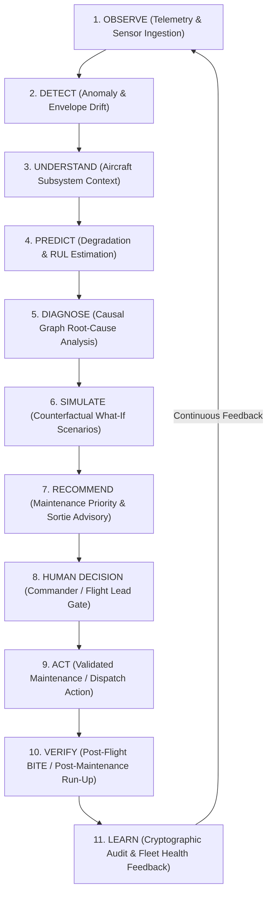

# ✈️ SageCommand Air Power System — Aero

**Intelligent Fleet Telemetry, Aircraft Digital Twin & Operational Decision Support Platform**  
*Smart India Hackathon (SIH) Prototype Initiative*

[](https://sih.gov.in)
[](#-current-status)
[](#)

> **SageCommand Air Power System (Aero)** is an intelligent, mission-critical decision support platform designed to transform heterogeneous aircraft telemetry, structural sensor streams, maintenance logs, and mission availability data into unified, actionable operational intelligence for aerospace commanders and maintenance leads.

---

## 🎯 Vision

The long-term vision of **Aero** is to create a continuously synchronized operational picture of individual aircraft and fleet-wide combat readiness. Aero acts as an explainable cognitive copilot for defense aviation personnel, delivering assistive intelligence for:

* **Aircraft Health Assessment:** Continuous tracking of structural, thermodynamic, and avionics subsystem integrity.
* **Predictive Maintenance:** Early warning of component fatigue before mission degradation occurs.
* **Anomaly Detection:** Real-time identification of subtle parameter drifts outside standard flight envelopes.
* **Root-Cause Analysis (RCA):** Rapid causal isolation across interconnected hydraulic, electrical, and avionics buses.
* **Remaining Useful Life (RUL) Estimation:** Physics- and statistical-based life consumption metrics in Flight Hours (FH) and Flight Cycles (FC).
* **Mission Readiness & Availability:** Translating current fleet health into verifiable sortie capacity.
* **Sortie Planning & Turnaround Support:** Optimizing hangar turnaround schedules and Line Replaceable Unit (LRU) allocation.
* **What-If Simulation:** Scenario forecasting under degraded operational states.
* **Fleet-Level Optimization:** Balancing maintenance workload across squadrons and air bases.

### 🔄 The Operational Paradigm:
$$\text{\bf Observe} \longrightarrow \text{\bf Understand} \longrightarrow \text{\bf Predict} \longrightarrow \text{\bf Decide} \longrightarrow \text{\bf Act} \longrightarrow \text{\bf Learn}$$

> [!IMPORTANT]
> **Human-in-the-Loop Governance:** Aero is explicitly designed as an **operator decision-support platform**. Aero does not perform autonomous combat operations or bypass human chain-of-command. Human commanders, flight leads, and maintenance officers retain absolute operational authority.

---

## 🇮🇳 SIH Problem Focus

Modern military and state aviation operations face acute challenges in sustaining high aircraft readiness while managing complex modern airframes:

1. **Massive Telemetry Volume:** A single modern aircraft flight produces millions of data points across avionics, engines (FADEC), structural health monitoring (HUMS), and environmental systems.
2. **Fragmented Information Silos:** Flight telemetry, scheduled maintenance databases, supply chain parts catalogs, and pilot debrief records exist across isolated legacy software.
3. **Complex Multi-System Fault Propagation:** Modern aircraft components are deeply coupled. An electrical voltage fluctuation can manifest as an avionics error or radar sensor dropout, obscuring the primary fault.
4. **Reactive vs. Predictive Servicing:** Traditional servicing relies heavily on static calendar intervals or post-failure repairs, resulting in Aircraft on Ground (AOG) downtime and unexpected sortie aborts.
5. **Dynamic Mission Readiness Demands:** Sortie planners must constantly answer: *"Can Squadron 101 scramble 8 fully mission-capable aircraft for a high-G tactical interception in 45 minutes?"*

**The Core Challenge:**  
Fragmented records make it nearly impossible to obtain an instant, unified, predictive view of:
$$\mathbf{\text{Aircraft Health}} \;+\; \mathbf{\text{Maintenance State}} \;+\; \mathbf{\text{Readiness Classification}} \;+\; \mathbf{\text{Mission Availability}}$$

---

## 💡 Our Proposed Solution

**Aero** bridges this gap by acting as an integrated aerospace intelligence layer connecting:

```
[ Flight Telemetry Fabric ] 
            +
[ Aircraft Digital Twin ] 
            +
[ Analytical AI/ML & Predictive Models ] 
            +
[ Root-Cause & Blast-Radius Engine ] 
            +
[ Deterministic Governance & Audit Gateway ] 
            ▼
Signals ──► Insights ──► Predictions ──► Recommendations
```

Aero continuously ingests high-rate aircraft telemetry, updates a virtual bitemporal **Aircraft Digital Twin**, detects emerging statistical anomalies, estimates subsystem wear, and generates defensible recommendations for flight leads and crew chiefs.

> [!NOTE]
> **SIH Demonstration Notice:** For the Smart India Hackathon prototype demonstration, Aero utilizes high-fidelity synthetic aircraft flight profiles, realistic sensor noise models, and simulated engine run-up datasets where real defense telemetry is classified or unavailable.

---

## 🧠 Core SIH Prototype Scope

The practical Minimum Viable Product (MVP) being implemented for SIH demonstrates the critical path of the operational loop:

### 1. Flight Telemetry Data Fabric 🧪
High-throughput ingestion and unit normalization for representative flight parameters:
* **Aerodynamics:** Altitude, True Airspeed (TAS), Indicated Airspeed (IAS), Mach Number, Normal Acceleration ($G_z$), Angle of Attack (AoA).
* **Propulsion / FADEC:** Engine Core RPM (N1/N2), Exhaust Gas Temperature (EGT), Fuel Flow Rate, Oil Pressure.
* **Subsystems:** Hydraulic Pressure, Core Avionics Bus Voltage, Cabin Pressurization.
* **Diagnostics:** Built-In Test Equipment (BITE) status flags and discrete fault codes.

### 2. Aircraft Digital Twin 🧪
A bitemporal software representation maintaining live aircraft state:
* Tail number, squadron assignment, and airframe serial identity.
* Cumulative Flight Hours (FH) and Landing/Stress Cycles (FC).
* Real-time subsystem state vector and recent telemetry buffer.
* Active anomalies, maintenance work status, and sortie readiness classification.

### 3. Anomaly Detection 🧪
Statistical baselining (Z-score, rolling variance, flight envelope boundary evaluation) to automatically flag out-of-nominal deviations before catastrophic subsystem failure occurs.

### 4. Predictive Maintenance & RUL 🧪
Prognostics estimating component degradation and Remaining Useful Life (RUL).  
*Scope Constraint:* To ensure technical defensibility, the SIH prototype focuses on a **representative subset of high-impact subsystems** (turbofan thermal fatigue and hydraulic pump pressure degradation) rather than attempting to model every aircraft component.

### 5. Root Cause Analysis (RCA) 🧪
Causal graph reasoning linking telemetry anomalies and subsystem dependencies to isolate root failure mechanisms from downstream symptoms.

### 6. Standardized Aircraft Readiness Classification 🧪
Classifies each aircraft using standard defense aviation categories:
* **FMC (Fully Mission Capable):** All flight, avionics, and operational subsystems fully operational.
* **PMC (Partially Mission Capable):** Minor non-flight-critical fault; cleared for restricted training or ferry sorties.
* **NMC (Non-Mission Capable):** Flight safety or mission-critical defect; grounded pending maintenance.

### 7. Mission Readiness Assessment 🧪
Aggregates individual aircraft readiness states into actionable squadron-level sortie generation assessments.

### 8. Aero Command Center UI 🧪
A modern, dark-mode tactical command console providing:
* Fleet status overview and squadron readiness summary.
* Individual aircraft health indicators and real-time telemetry gauges.
* Anomaly alert feed and causal diagnosis breakdown.
* Maintenance turnaround priority recommendations.

---

## 🔄 Operational Intelligence Loop

Aero executes along a closed-loop operational lifecycle:



*For the SIH MVP, Aero focuses on demonstrating stages 1 through 8 (Observe through Human Decision).*

---

## 🏗️ Target Architecture

```
                    ┌─────────────────────────────────────────────────────┐
                    │               AERO COMMAND CENTER UI                │
                    │        (Next.js 16 / React 19 Obsidian Console)     │
                    └──────────────────────────┬──────────────────────────┘
                                               │
                               WebSocket / REST API
                                               │
                    ┌──────────────────────────▼──────────────────────────┐
                    │             API GATEWAY & GOVERNANCE                │
                    │      (FastAPI, RBAC, Request Tracing, CORS)         │
                    └─────────────┬─────────────────────────┬─────────────┘
                                  │                         │
                  Read Inquiries  │                         │ Transaction Commit
                                  ▼                         ▼
┌─────────────────────────────────────────────────┐  ┌───────────────────────────────────┐
│              AI INTELLIGENCE LAYER              │  │   DETERMINISTIC EXECUTION GATEWAY │
│   (Purely Analytical — Zero Mutation Rights)    │  │   (10-Gate Write Boundary)        │
├─────────────────────────────────────────────────┤  ├───────────────────────────────────┤
│ • Multimodal Sensor Fusion Service              │  │ • Two-Person Rule Authorization   │
│ • Flight Envelope Anomaly Detection             │  │ • Policy Precedence Enforcement   │
│ • Component Degradation & RUL Estimator         │  │ • SHA-256 Tamper Verification     │
│ • Subsystem Root-Cause Analysis (Causal Graphs) │  │ • Idempotency Deduplication       │
│ • Counterfactual What-If Simulation Engine      │  │ • Atomic Action Rollback          │
└─────────────────────────┬───────────────────────┘  └─────────────────┬─────────────────┘
                          │                                            │
                          ▼                                            ▼
┌─────────────────────────────────────────────────┐  ┌───────────────────────────────────┐
│              AIRCRAFT DIGITAL TWIN              │  │    CRYPTOGRAPHIC AUDIT LEDGER     │
│  - Virtual Aircraft State & Flight Cycles       │  │  - Append-Only SHA-256 Chain      │
│  - FMC / PMC / NMC Readiness State Machine      │  │  - Chain of Custody Audit Trail   │
└─────────────────────────┬───────────────────────┘  └───────────────────────────────────┘
                          │
                          ▼
┌────────────────────────────────────────────────────────────────────────────────────────┐
│                              TELEMETRY DATA FABRIC                                     │
│                (High-Concurrency SQLite WAL Engine / Sensor Queue)                     │
└────────────────────────────────────────────────────────────────────────────────────────┘
```

---

## ♻️ SageCommand Reuse Strategy

Aero is developed by selectively harvesting battle-tested, high-reliability infrastructure mechanisms from the previous **SageCommand V3** project (a production-grade system with 1,200+ unit and integration tests):

| Reused Architectural Mechanism | Proven Capability in V3 | How Aero Leverages It |
| :--- | :--- | :--- |
| **Deterministic Execution Gateway** | 10-gate write boundary, rollback, concurrency locks | Enforces strict safety gates on maintenance proposals and mission dispatches. |
| **Policy Enforcement Engine** | Priority evaluation ($\text{DENY} > \text{REQUIRE\_APPROVAL} > \text{HOLD} > \text{ALLOW}$) | Evaluates flight safety limits and squadron standard operating procedures. |
| **Cryptographic Audit Ledger** | Append-only, SHA-256 hash-chained immutable logging | Provides an auditable "black box" record of AI recommendations and commander approvals. |
| **Multimodal Sensor Fusion** | Temporal alignment, cross-modal agreement, unit conversion | Normalizes heterogeneous avionics, thermodynamic, and vibration sensor streams. |
| **Bitemporal Knowledge Graph** | Graph traversals, bitemporal valid-time queries | Models aircraft subsystem dependencies and cascading failure paths. |
| **What-If Simulation Framework** | Counterfactual delta computation & constraint checks | Simulates mission feasibility under partial subsystem degradation. |

### 🚫 Complete Rejection of Manufacturing Domain
While computational algorithms are reused, **Aero completely discards the legacy manufacturing domain model**.  
Aero introduces a dedicated, purpose-built **Aerospace Domain Model** (`Aircraft`, `Airframe`, `Squadron`, `Sortie`, `FlightHours`, `Avionics`, `Propulsion`, `BITE`) with zero references to factory plants, pumps, or commercial supply chains.

---

## 🛠️ Technology Direction

* **Backend Framework:** Python 3.12, FastAPI `>=0.115.0`, Uvicorn (ASGI)
* **Data Contracts:** Pydantic v2 (Strict typing, zero deprecated v1 validators)
* **Database & Persistence:** SQLAlchemy 2.0, SQLite with Write-Ahead Logging (`WAL` mode, 5000ms busy timeout)
* **Orchestration:** LangGraph (StateGraph multi-agent DAGs with native Human-in-the-Loop interrupts)
* **Security & Auditing:** Cryptography (SHA-256 state hashing), PyJWT (Role-based access control)
* **Frontend Web Console:** Next.js 16 (App Router), React 19, TypeScript, Tailwind CSS, Lucide Icons
* **Real-Time Streaming:** WebSockets (Low-latency telemetry streaming and alert interrupts)

---

## 📊 SIH Demonstration Flow

The planned demonstration will walk through an end-to-end operational scenario:

1. **Telemetry Streaming:** Simulated flight telemetry for a fighter aircraft enters the system during a mission sortie.
2. **Ingestion & Normalization:** Telemetry data fabric validates sensor units and checks flight envelope boundaries.
3. **Digital Twin Update:** Cumulative flight hours and engine temperature cycles update on the aircraft's twin.
4. **Anomaly Triggered:** An abnormal EGT thermal divergence combined with high-frequency turbine vibration is flagged.
5. **Intelligence Analysis:** Sensor fusion evaluates cross-modal agreement between temperature and vibration sensors.
6. **Degradation / RUL Estimation:** Prognostic model estimates turbine blade thermal wear and computes remaining safe flight hours.
7. **Root-Cause Analysis:** RCA graph isolates a clogged cooling bleed valve as the primary root failure cause.
8. **Readiness Reclassification:** Aircraft status transitions from **FMC** (Fully Mission Capable) to **PMC** (Partially Mission Capable).
9. **Maintenance Advisory:** A prioritized maintenance work proposal for bleed valve replacement is generated.
10. **Mission Availability Impact:** Squadron mission planner automatically flags that this airframe cannot be scheduled for a high-altitude combat sortie.
11. **Command Dashboard Presentation:** The Aero Command Center visualizes the situation, root cause, and impact for decision-makers.
12. **Human Governance Gate:** A maintenance lead reviews and authorizes the scheduled repair through the Execution Gateway.

---

## 🗺️ Development Roadmap

```
Phase 0: Architecture Reconnaissance & SIH Scope Definition      [✅ Completed]
Phase 1: Technical Foundation & Execution Gateway Scaffolding    [✅ Completed]
Phase 2: Aeronautical Domain Model & Ontology                    [🚧 Planned - Next Step]
Phase 3: Flight Telemetry Data Fabric (Ingestion & Normalizer)   [🚧 Planned]
Phase 4: Aircraft Digital Twin State Machine                     [🚧 Planned]
Phase 5: Subsystem Intelligence Layer (Anomaly, RUL, RCA)        [🚧 Planned]
Phase 6: Mission & Fleet Readiness Assessor                      [🚧 Planned]
Phase 7: Aero Command Center Tactical UI                         [🚧 Planned]
Phase 8: Advanced Counterfactual Simulation & Fleet Optimization [🔭 Future Vision]
```

### Roadmap Details:
* **Phase 0 — Repository & Architecture [✅ Completed]:** Initialized repository, performed comprehensive audit of reusable SageCommand foundations, mapped the operational loop, defined SIH MVP boundaries.
* **Phase 1 — Technical Foundation [✅ Completed]:** Established clean FastAPI application structure, Pydantic v2 base envelopes, SQLite WAL database context, deterministic policy engine, SHA-256 audit ledger, and 10-gate execution gateway with 25 passing automated tests.
* **Phase 2 — Aero Domain Foundation [🚧 Planned]:** Canonical domain schemas: `Aircraft`, `Airframe`, `Subsystem`, `Squadron`, `Wing`, `AirBase`, `Sortie`, `FlightHours`, `FlightCycles`, `BITE`, `ReadinessClassification`.
* **Phase 3 — Telemetry Data Fabric [🚧 Planned]:** Real-time flight telemetry parser, flight envelope boundary checker, synthetic telemetry flight profile generator.
* **Phase 4 — Aircraft Digital Twin [🚧 Planned]:** Bitemporal twin synchronization, component fatigue accumulator, twin state diffs.
* **Phase 5 — Intelligence Layer [🚧 Planned]:** Statistical anomaly detection, component RUL estimator, causal graph RCA.
* **Phase 6 — Mission Readiness [🚧 Planned]:** FMC/PMC/NMC state machine, squadron-level sortie readiness calculator.
* **Phase 7 — Aero Command Center [🚧 Planned]:** Full interactive Next.js dashboard featuring fleet matrix, telemetry dials, alert cards, and governance modals.
* **Phase 8 — Advanced Intelligence [🔭 Future]:** Dynamic what-if combat scenario simulation, multi-base maintenance workload optimization, air-gapped model deployment.

---

## 🔐 Safety & Human Governance

Aero adheres to non-negotiable safety and defense compliance principles:
* **Strict Decision Support:** Aero advises; it never commands. Autonomous weapon release or unapproved dispatch actions are architecturally prohibited.
* **Two-Person Rule:** High-risk actions require independent human clearance. An operator cannot approve their own high-risk action.
* **Deterministic Write Boundary:** AI outputs cannot directly modify database state. Every state change must be validated by the 10-gate Execution Gateway.
* **Cryptographic Accountability:** All system recommendations, human approvals, and policy evaluations are committed to an append-only, SHA-256 hash-chained audit ledger.

---

## 📁 Repository Structure

```
Sage-Command-Air-Power/
├── backend/                           # FastAPI Python Backend
│   ├── app/
│   │   ├── api/routes/health.py       # Health diagnostics endpoints
│   │   ├── contracts/                 # Pydantic v2 response envelopes & caller identity
│   │   ├── core/                      # Settings, structured logging, exception hierarchy
│   │   ├── db/database.py             # SQLAlchemy 2.0 & SQLite WAL connection manager
│   │   ├── services/
│   │   │   ├── policy_engine.py       # Deterministic policy engine
│   │   │   ├── audit_ledger.py        # Cryptographic SHA-256 audit ledger
│   │   │   └── execution_gateway.py   # 10-gate transactional execution gateway
│   │   └── main.py                    # Application entrypoint & lifespan handlers
│   ├── tests/                         # 25 automated unit and integration tests
│   └── requirements.txt               # Backend dependencies
├── frontend/                          # Next.js 16 / React 19 Frontend Shell
│   ├── app/
│   │   ├── globals.css                # Obsidian HUD styling
│   │   ├── layout.tsx                 # Root layout
│   │   └── page.tsx                   # System Foundation dashboard shell
│   └── package.json                   # Frontend dependencies
├── docs/                              # Technical Documentation
│   ├── AERO_CODEBASE_RECONNAISSANCE.md # Predecessor audit & reuse analysis
│   └── ARCHITECTURE.md                # System Architecture Baseline Specification
├── .env.example                       # Safe environment variables template
├── .gitignore                         # Comprehensive git ignore rules
├── powershell.cmd                     # Windows execution proxy
└── README.md                          # This document
```

---

## 📌 Current Status

**Current Status: 🚧 Early Development / SIH Prototype Baseline**

* ✅ Repository established and synchronized on GitHub.
* ✅ Architectural reconnaissance completed ([`docs/AERO_CODEBASE_RECONNAISSANCE.md`](./docs/AERO_CODEBASE_RECONNAISSANCE.md)).
* ✅ Reusable core foundation scaffolded with 25 passing automated tests ([`docs/ARCHITECTURE.md`](./docs/ARCHITECTURE.md)).
* 🚧 Active implementation focusing on **Phase 2 (Aerospace Domain Model)**.

---

## 🤝 Development Philosophy

> *"Reuse proven infrastructure.  
> Build clean Aero domain models.  
> Prefer deterministic and explainable intelligence.  
> Keep humans firmly in the decision loop.  
> Build the SIH MVP first.  
> Design the architecture for future defense-grade expansion."*

---

## 📚 Documentation Links

* 📄 **[Aero Codebase Reconnaissance Report](./docs/AERO_CODEBASE_RECONNAISSANCE.md)** — Comprehensive architectural audit of SageCommand V3 reuse, operational loop mapping, and risk analysis.
* 📄 **[System Architecture Specification](./docs/ARCHITECTURE.md)** — Technical baseline documentation for Phase 1 foundations, contracts, and execution gates.

---
*Developed for the Smart India Hackathon (SIH) // SageCommand Air Power System Team*
