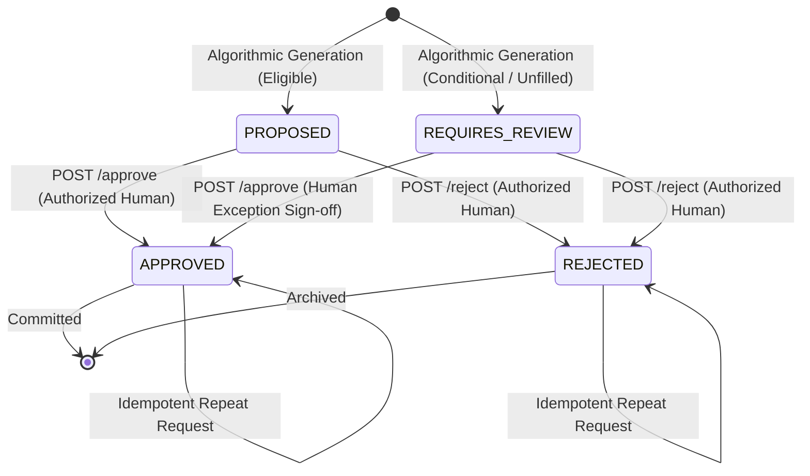

# SageCommand Air Power System (Aero) — Mission Manager & Air Tasking Order (ATO) Foundation

**Phase 7: Governed Mission Management & Synthetic ATO Allocation Decision-Support Foundation**  
*Document Version:* 1.0.0  
*Date:* 2026-10-10  
*Status:* IMPLEMENTED BASELINE (Verified by 269 Automated Unit, Integration & E2E Tests)  

---

## 1. Executive Summary & Purpose

The **Mission Manager & Air Tasking Order (ATO) Foundation** extends the SageCommand Air Power System (Aero) with deterministic, explainable, and governed mission-management capabilities. Operating strictly as a non-operational Smart India Hackathon (SIH) prototype, it bridges tactical mission requirements with engineering reality:

$$\mathbf{\text{Synthetic ATO Demand}} \;+\; \mathbf{\text{Authoritative Readiness}} \;+\; \mathbf{\text{Digital Twin Health}} \;+\; \mathbf{\text{Active Anomalies}} \;+\; \mathbf{\text{Prognostic Lifing (RUL)}} \;\Longrightarrow\; \mathbf{\text{Governed Allocation Proposal}}$$

Aero automates the complex multi-signal qualification of aircraft against proposed sorties, identifies maintenance and schedule conflicts, and generates transparent allocation recommendations. In adherence to the platform's core governance principles, **all algorithmic proposals remain strictly advisory** until reviewed and approved by an authorized human operator via the cryptographic audit ledger.

---

## 2. Safety & Scope Boundaries

> [!IMPORTANT]
> **Strict Prototype Non-Operational Boundaries:**
> 1. **No Combat or Weapon Commands:** Zero weapons, targeting, ordnance, payload release, Rules of Engagement (ROE), or combat kill-chain parameters are accepted or generated.
> 2. **Generic Demonstration Identifiers:** Air bases, squadron identifiers, and coordinates utilize generic synthetic demonstration tokens (e.g., `BAREILLY_AFS`, `AC-ALPHA-01`, `ATO-DEMO-01`).
> 3. **No Autonomous Tasking or Flight Control:** Algorithmic recommendations are read-only proposals. The system has zero interface to autopilot, flight-control computers, or physical actuators.
> 4. **No Direct Production Military Integration:** The system parses a documented synthetic JSON schema; it does not ingest live or classified military ATO streams.
> 5. **Human-in-the-Loop Supremacy:** Algorithmic proposals are stamped `PROPOSED` or `REQUIRES_REVIEW`. No proposal can transition to `APPROVED` without explicit human clearance through the governed API boundary.

---

## 3. Supported ATO Document Schema

The synthetic ATO ingestion engine enforces a fail-closed schema (version `1.0.0`, `1.0`, or `aero-ato-v1`). Arbitrary content and forbidden operational keywords are rejected prior to execution.

### 3.1 Document Specification

| Field | Type | Description |
| :--- | :--- | :--- |
| `ato_id` | `String` | Unique synthetic document identifier (e.g., `ATO-DEMO-20261010-01`). |
| `schema_version` | `String` | Document schema format (`1.0.0`). |
| `issue_timestamp` | `ISO-8601 Datetime` | Document generation timestamp. |
| `planning_window_start` | `ISO-8601 Datetime` | Operational planning window inception. |
| `planning_window_end` | `ISO-8601 Datetime` | Operational planning window horizon (max 72 hours). |
| `source` | `String` | Ingestion provenance tag (`SYNTHETIC_SIH_DEMO`). |
| `sorties` | `List[ProposedSortie]` | Collection of non-operational synthetic sortie requirements. |

### 3.2 Proposed Sortie Specification

| Field | Type | Description |
| :--- | :--- | :--- |
| `sortie_id` | `String` | Unique sortie identifier within the ATO. |
| `mission_category` | `String` | Synthetic profile category (`COMBAT_AIR_PATROL`, `RECONNAISSANCE`, `TRAINING`, `FERRY`). |
| `start_time` | `ISO-8601 Datetime` | Target sortie launch timestamp. |
| `end_time` | `ISO-8601 Datetime` | Target sortie recovery timestamp (must be strictly after `start_time`). |
| `required_aircraft_type` | `String` | Airframe type specification (e.g., `HAL Tejas Mk1A`). |
| `required_capabilities` | `List[String]` | Subsystem capability tags (e.g., `["BVR_RADAR", "AIR_TO_AIR"]`). |
| `min_aircraft_count` | `Integer` | Airframe commitment quota (default 1). |
| `priority` | `Enum` | Operational priority (`URGENT`, `HIGH`, `ROUTINE`, `LOW`). |
| `estimated_duration_hours`| `Float` | Derived or specified flight commitment duration in flight hours. |
| `status` | `Enum` | Initial state (`UNASSIGNED`). |
| `explanation` | `String` | Contextual justification. |

---

## 4. Multi-Signal Aircraft Eligibility Engine

The `AircraftEligibilityEvaluator` deterministically evaluates candidate airframes across 8 rigorous evidence channels:

```
Candidate Airframe
   ├── 1. Lifecycle Check: Status must be ACTIVE (RETIRED or INACTIVE triggers INELIGIBLE)
   ├── 2. Airframe Type Matching: Matches sortie requirement (mismatch triggers INELIGIBLE)
   ├── 3. Authoritative Readiness: 
   │       ├── Missing Record: INSUFFICIENT_EVIDENCE (never silently assumes ready)
   │       ├── NMC (Non-Mission Capable): INELIGIBLE
   │       ├── PMC (Partially Mission Capable): ELIGIBLE_WITH_REVIEW
   │       └── Low Confidence (< 0.60): ELIGIBLE_WITH_REVIEW
   ├── 4. Maintenance Conflict Check:
   │       ├── IN_PROGRESS event: INELIGIBLE
   │       └── SCHEDULED event overlapping sortie window: INELIGIBLE
   ├── 5. Subsystem Intelligence (Active Anomalies):
   │       ├── Any active CRITICAL anomaly: INELIGIBLE
   │       └── Any active HIGH anomaly: ELIGIBLE_WITH_REVIEW
   ├── 6. Digital Twin State:
   │       ├── Health score < 50.0: INELIGIBLE
   │       ├── Wear index > 0.90: ELIGIBLE_WITH_REVIEW
   │       └── Sensor data quality != VALID: ELIGIBLE_WITH_REVIEW
   └── 7. Prognostics & RUL Safeguard:
           ├── GROUND_FOR_REVIEW forecast: INELIGIBLE
           ├── PRIORITY_INSPECTION forecast: ELIGIBLE_WITH_REVIEW
           ├── Unsupported RUL (is_supported=False): ELIGIBLE_WITH_REVIEW
           └── Supported RUL < (Sortie Duration + 5.0h Buffer): INELIGIBLE
```

### 4.1 RUL Semantic Safeguard
In Phase 6, nominal fallback ceilings (100.0 flight hours) could theoretically be misinterpreted as verified infinite life for airframes with minimal observation history. Phase 7 formalizes a critical semantic safeguard:
* When `is_supported=False` or `rul_status="INSUFFICIENT_DATA"`, the evaluation categorizes the airframe as `ELIGIBLE_WITH_REVIEW`, requiring explicit human commander sign-off.
* The allocation scoring engine applies a conservative fallback baseline score of 5.0 points rather than full prognostic credit.

---

## 5. Deterministic Allocation Engine & Scoring Formula

The `AllocationEngine` solves the synthetic sortie assignment problem using a bounded greedy matching algorithm with stable, reproducible tie-breaking:

### 5.1 Sortie Ordering
Sorties are ordered by:
1. Operational Priority: $\text{URGENT} (4) > \text{HIGH} (3) > \text{ROUTINE} (2) > \text{LOW} (1)$
2. Planned Start Time: Chronological ascending
3. Sortie Identifier: Lexicographical ascending

### 5.2 Deterministic Scoring Formula
For each eligible airframe, a composite score $S \in [0, 100]$ is computed:

$$S = S_{\text{readiness}} + S_{\text{health}} + S_{\text{wear}} + S_{\text{rul}} + S_{\text{tier}} - P_{\text{anomaly}}$$

Where:
* **Readiness Score ($S_{\text{readiness}}$):**
  * $\text{FMC} = 30.0$
  * $\text{PMC} = 15.0$
  * $\text{Other} = 0.0$
* **Health Score ($S_{\text{health}}$):**
  $$S_{\text{health}} = \frac{\text{Twin Health}}{100.0} \times 30.0$$
* **Wear Score ($S_{\text{wear}}$):**
  $$S_{\text{wear}} = \max(0.0, 1.0 - \text{Wear Index}) \times 15.0$$
* **Prognostic RUL Score ($S_{\text{rul}}$):**
  * If supported: $\min(1.0, \frac{\text{RUL Hours}}{100.0}) \times 15.0$
  * If unsupported / fallback: $5.0$
* **Tier Bonus ($S_{\text{tier}}$):**
  * $\text{ELIGIBLE} = 10.0$
  * $\text{ELIGIBLE\_WITH\_REVIEW} = 0.0$
* **Anomaly Penalty ($P_{\text{anomaly}}$):**
  $$P_{\text{anomaly}} = \text{Count of Active HIGH Anomalies} \times 15.0$$

### 5.3 Non-Overlapping Asset Guarantee
The engine maintains an internal interval map `assigned_schedules[aircraft_id]`. Once an airframe is allocated to a sortie in temporal interval $[t_{\text{start}}, t_{\text{end}}]$, no subsequent overlapping sortie can claim that airframe. The airframe remains available for future non-overlapping sequential sorties.

### 5.4 Stable Tie-Breaking
When candidate airframes yield identical composite scores, ties are deterministically resolved by:
1. Higher digital twin health score
2. Airframe identifier ascending lexicographically (`AC-ALPHA-01` before `AC-BRAVO-02`)

---

## 6. Governed Human Approval Lifecycle

Allocation proposals are generated in an advisory state:
* `PROPOSED`: Fully qualified under FMC criteria; awaiting operational sign-off.
* `REQUIRES_REVIEW`: Qualified under conditional criteria (e.g., PMC readiness, unsupported RUL, high anomalies) or unfilled.

### 6.1 State Transitions



* **Idempotency:** Resending an identical approval request succeeds safely without state duplication or database collision.
* **Invalid Transitions:** An already `APPROVED` proposal cannot be directly transitioned to `REJECTED` without an explicit revocation workflow.

---

## 7. Cryptographic Audit Ledger Integration

Every operational action is committed to the append-only SHA-256 hash-chained audit ledger (`default_audit_ledger`):
* `ATO_IMPORTED`: Document ingestion with sortie count and actor metadata.
* `ATO_ALLOCATIONS_GENERATED`: Batch proposal generation with matched and unfilled counts.
* `MISSION_ALLOCATION_APPROVED`: Human sign-off recording actor ID, proposal ID, airframe ID, justification, and timestamp.
* `MISSION_ALLOCATION_REJECTED`: Human rejection with operational rationale.

---

## 8. Verified Synthetic Demonstration Scenarios

The suite includes end-to-end tests formally validating 10 required operational scenarios:

| # | Scenario | Expected Behavior | Verification Status |
| :- | :--- | :--- | :--- |
| **1** | Multiple Eligible Aircraft | Deterministic ranking; highest-scoring airframe assigned; second-best listed in alternatives. | Verified (`test_scenario_1`) |
| **2** | Authoritative Readiness Unavailable | NMC readiness status immediately disqualifies airframe; conflicts list specific reasons. | Verified (`test_scenario_2`) |
| **3** | Active Critical Anomaly | Airframe disqualified immediately with `INELIGIBLE` finding. | Verified (`test_scenario_3`) |
| **4** | Maintenance-Window Conflict | Scheduled depot/turnaround maintenance overlapping sortie window prevents assignment. | Verified (`test_scenario_4`) |
| **5** | Unsupported / Low-Confidence Prognostics | RUL semantic safeguard sets `ELIGIBLE_WITH_REVIEW`; proposal requires mandatory operator review. | Verified (`test_scenario_5`) |
| **6** | Overlapping Sorties | Higher priority sortie claims asset; lower priority sortie remains unfilled; zero double-booking. | Verified (`test_scenario_6`) |
| **7** | No Eligible Aircraft | Returns explicit unfilled proposal with conflict diagnostic summary. | Verified (`test_scenario_7`) |
| **8** | Malformed ATO Input | Invalid schemas, inverted planning windows, or forbidden keys safely rejected. | Verified (`test_scenario_8`) |
| **9** | Governed Human Approval & Rejection | Algorithmic proposal transitions to `APPROVED` or `REJECTED` via authorized endpoints with audit ID. | Verified (`test_scenario_9`) |
| **10**| Duplicate Approval Idempotency | Re-submitting approval returns 200 OK with confirmed status and existing audit correlation ID. | Verified (`test_scenario_10`)|

---

## 9. API Reference

All Phase 7 endpoints conform to standard Aero response envelopes (`ApiResponse[T]`):

* `POST /api/v1/ato/validate` — Validates synthetic ATO schema, temporal boundaries, and safety constraints.
* `POST /api/v1/ato/import-demo` — Imports and persists a synthetic ATO document and its proposed sorties.
* `GET /api/v1/ato/{ato_id}` — Retrieves persisted ATO document metadata and child sorties.
* `GET /api/v1/aircraft/{aircraft_id}/mission-eligibility` — Standalone airframe eligibility evaluation.
* `POST /api/v1/ato/{ato_id}/allocation-proposals` — Computes and persists deterministic sortie allocation proposals.
* `GET /api/v1/ato/{ato_id}/allocation-proposals` — Lists stored proposals for an ATO.
* `POST /api/v1/allocation-proposals/{proposal_id}/approve` — Authorizes an allocation proposal through human governance.
* `POST /api/v1/allocation-proposals/{proposal_id}/reject` — Rejects an allocation proposal with explanation.

---

## 10. Limitations & Future Extensions

1. **Synthetic Scope:** Locations and identifiers use generic demonstration tokens. Physics-based tactical routing is outside prototype scope.
2. **Matching Complexity:** Employs a deterministic priority-ordered greedy matching engine optimal for squadron demonstrations ($N \le 50$ airframes). Integer Linear Programming (ILP) or Hungarian bipartite matching can be introduced in Phase 8 for fleet-scale operations.
3. **Turnaround Times:** Airframe turnaround ground handling intervals are currently estimated. Phase 8 will introduce dynamic maintenance turnaround simulation.
